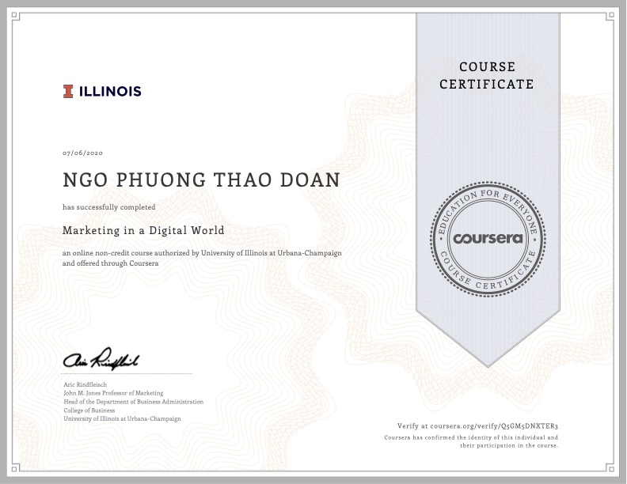
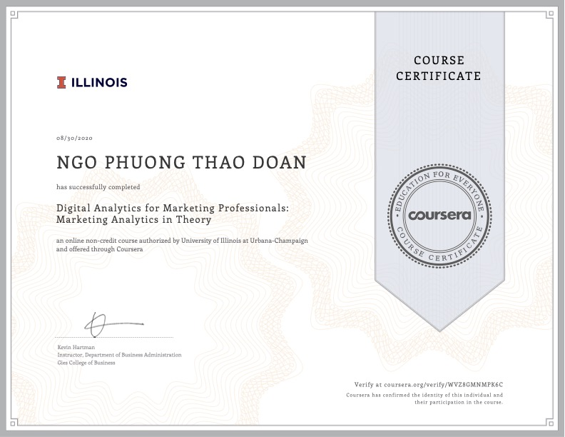
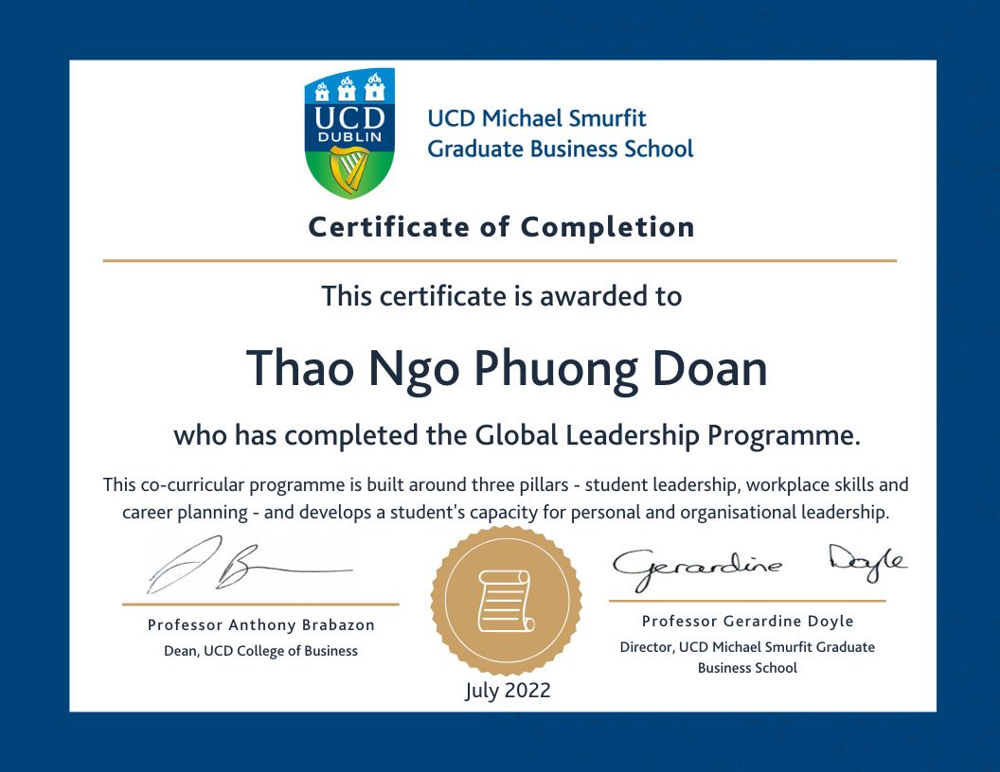
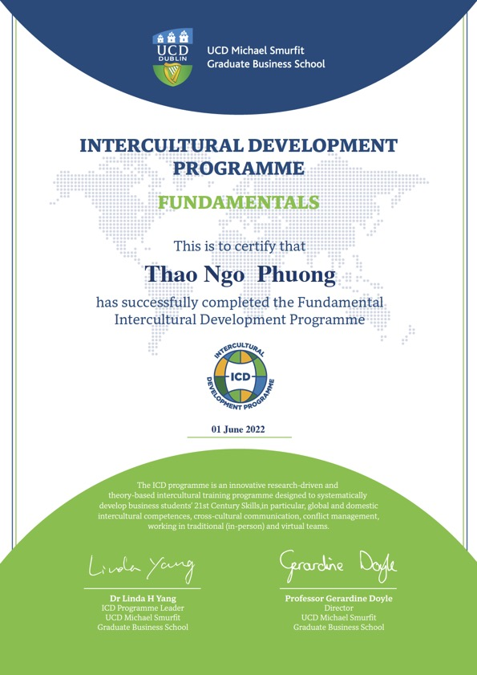

# Digital Marketing
## Coursera

  <b><i>Time</i></b>: 2020
  <b><i>Description</i></b>: Lifelong self-studying is my critical characteristic to pursue the vast knowledge of humankind. I perpetually take advantage of enhancing my specialised knowledge in Digital Marketing in the industry 4.0 technologies by enrolling in  Coursera online courses. The certificates in Marketing Analytics Theory & Marketing in a Digital World supported me in keeping pace with the world's tendencies, equipping me with related career opportunities.

 
 
 

 
 
 
 

# Ireland Contest 2021
## Education in Ireland Vietnam

  <b><i>Time</i></b>: 2021
  <b><i>Location</i></b>: Ho Chi Minh city, Vietnam
  <b><i>Award</i></b>: Top 25 best videos
  <b><i>Person in charge</i></b>: Thao Doan
  <b><i>Description</i></b>: Ireland Contest 2021 - Unleash your creativity with Ireland is an annual competition which is sponsored by Education in Ireland Vietnam organization to encourage Vietnamese to discover about Ireland, such as its people, culture, lifestyles, customs, and education system. While preparing for my application for a Master's course in Ireland, I took a chance to join the competition and was proudly in the top 25.

`video: https://www.youtube.com/watch?v=Zs92KXDT_Z0&t=89s`

 
 
 
 

# Global Leadership Programme (GLP)
## UCD Michael Smurfit Business School

  <b><i>Time</i></b>: 2022
  <b><i>Location</i></b>: Dublin, Ireland
  <b><i>Description</i></b>: Leadership is the skill to lead, the will to lead, and the integrity to lead. That is why completing the GLP means so much to me.
                         GLP is a top-notch extracurricular program offered by UCD Michael Smurfit Graduate Business School to assist me in understanding the emphasis on essential elements of developing a solid leadership mindset. A fantastic year has been spent enhancing my leadership and working skills in diverse teams, primarily focusing on three pillars: student leadership, workplace skills, and career planning.

 
 
 
 

# Intercultural Development Programme (ICD)
## UCD Michael Smurfit Business School

  <b><i>Time</i></b>: 2022
  <b><i>Location</i></b>: Dublin, Ireland
  <b><i>Description</i></b>: A prestigious certificate of Advance Level for my constant effort. This program is worthwhile to improve cultural competence in terms of global mindset, teamwork, conflict management, problem solving, critical thinking, ect.
                                 The ICD has recently also been awarded by the global network Association of MBAs the #AMBA & #BGA Excellence Award 2022 for the Best Culture Diversity and Inclusion Initiative.

