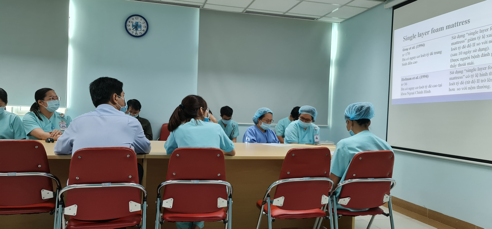

 
 
 
 

# External Product Training
## Education Simulation
### Laerdal

  <b><i>Time</i></b>:2021
  <b><i>Location</i></b>: HCMC Oncology Hospital - Branch 2, Vietnam
  <b><i>Description</i></b>: Conducted hands-on simulation for healthcare physicians regarding resuscitation training before the handover.
The simulators manifest vital signs, clinical signs and symptoms. Simulated patient monitors can be added to enhance the realism of scenario-based learning.

`video: https://www.youtube.com/watch?v=ja_M0ffeNDM`

 
 
 

## Hospital Facilities
### Hill-rom

  <b><i>Time</i></b>: 2020
  <b><i>Location</i></b>: HCMC Univeristy of Medicine and Pharmacy, Vietnam
  <b><i>Description</i></b>: The training session emphasized raising customer awareness about using technological products in patient care. Hill-rom is a leading provider of medical beds which integrate the high-tech application.

