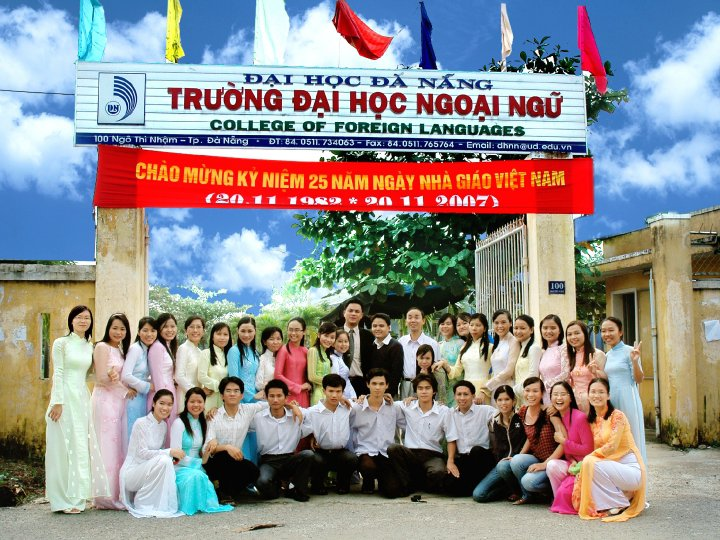
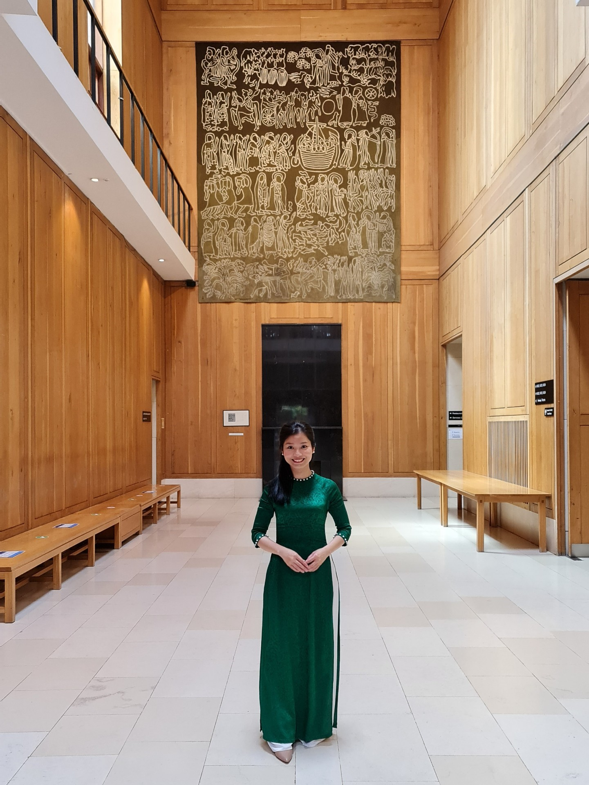
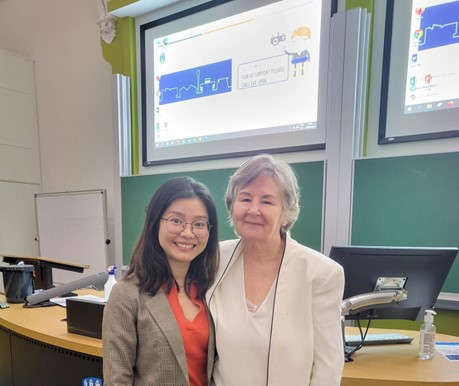
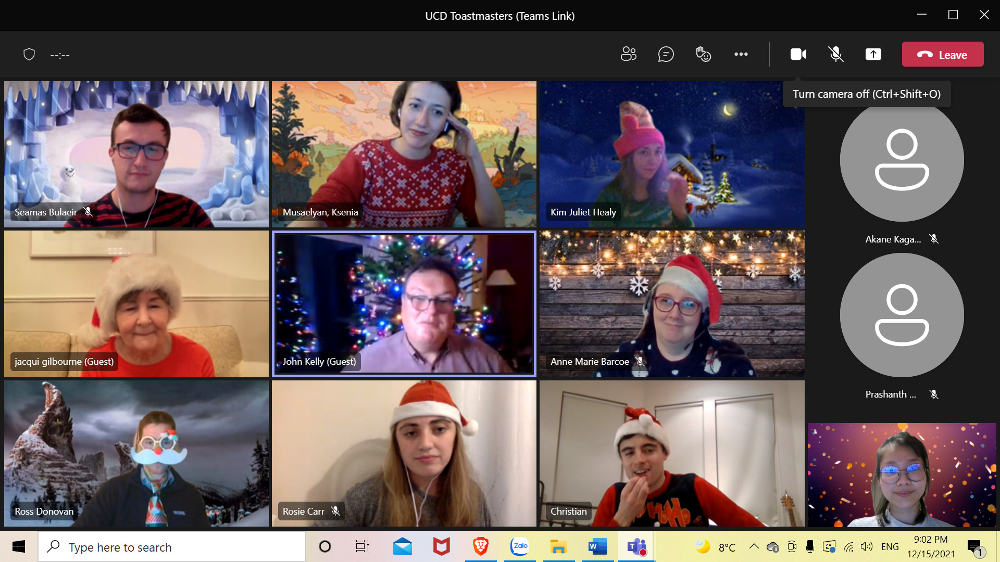

# College of Foreign Languages
## Danang University
## Major: English

  <b><i>Time</i></b>: 2004-2008
  <b><i>Location</i></b>: Danang city, Vietnam
  <b><i>Description</i></b>: My bachelor's degree was in English teaching, so I was trained in the teaching methodology and skills besides four foundation requirements (speaking, listening, reading, and writing). The course provided me with an understanding of British and American cultures and languages. Further, I could inspire the young generation on the importance of English when conducting in-class sessions, improving the quality of English usage in the workplace.

 
 
 

 
 
 
 

# UCD Michael Smurfit Business School
## Major: Master in Management

  <b><i>Time</i></b>: 2021-2022
  <b><i>Location</i></b>: Dublin, Ireland
  <b><i>Description</i></b>: I decided to study MSc in Management which generates holistic perspectives such as Marketing, Corporate Finance, Accounting, Global Strategy, Human Resource Management, Project Management, Leadership & Organizational Behaviour, Operation & Supply Chain, etc. Through the course, I am well-equipped with academic knowledge and beyond decision-making capability, critical thinking, and problem-solving skills.

 
 
 

 
 
 
 

# Smurfit Toastmasters Club

  <b><i>Time</i></b>: since 2021
  <b><i>Location</i></b>: Dublin, Ireland
  <b><i>Description</i></b>: I have been an annual member of the Smurfit Toastmasters club since I started studying here. The club currently runs a hybrid, and I am fond of offline events every two weeks. My public speaking skill is improving day by day. Moreover, my leadership skills can develop when I take the role of meeting host. I have chances to meet and share ideas with many people from different backgrounds. I have also learnt how diversity and inclusion are applied in communication. Highly recommend Toastmaster to everyone.

 
 
 

