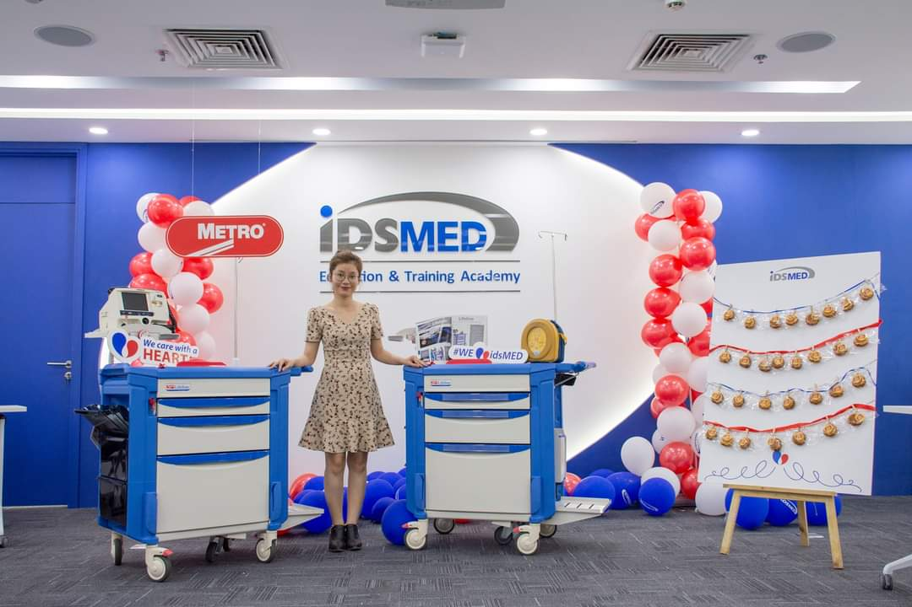
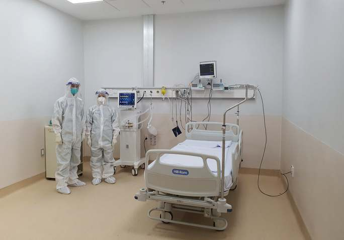
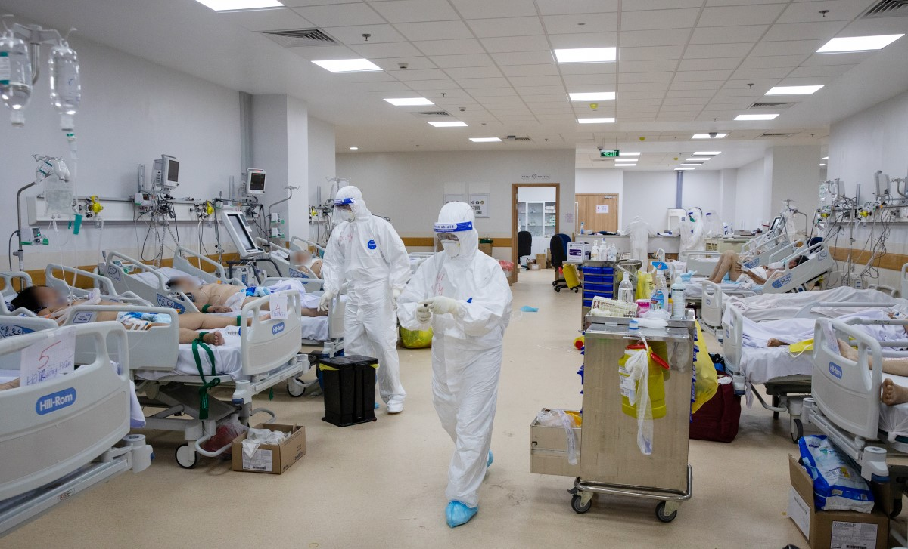

# Internal Product Launching
## Metro Emergency Cart

  <b><i>Time</i></b>: 10 Nov 2020
  <b><i>Location</i></b>: Ho Chi Minh city, Vietnam
  <b><i>Person in charge</i></b>: Thao Doan
  <b><i>Target</i></b>: Sales team, Project team, Tender team, Pricing team
  <b><i>Stakeholders</i></b>: Metro, IdsMed, hospitals, clinics
  <b><i>Description</i></b>: Metro is the well-known US-based manufacturer in terms of healthcare, commercial & foodservice. By launching a top-notch product in Vietnam market, it aimed to bring a comprehensive medical solution for domestic hospitals and clinics.
The Metro emergency cart incorporates a custom fifth-wheel steering assist system and an ergonomic grip to ensure optimum control when in motion and manoeuvrability during a code.

 
 
 
 

# Project of 1000 Electric Beds
## Hillrom Medical Bed

  <b><i>Time</i></b>: 2020
  <b><i>Location</i></b>: HCMC Oncology hospital - Branch 2 - Vietnam
  <b><i>Person in charge</i></b>: Thao Doan & Project team
  <b><i>Description</i></b>: This project had prolonged about 5 years to complete. There was enormous coordination across functional teams and stakeholders, including marketing, sales, tender, project, logistics, and board of directors from the company, Oncology hospital, government, and Hill-rom. I was proud to be a core team member to deal with price negotiation, configuration preparation for tender submission, product placement and training. The new campus would feature 1,000 beds divided into one-bed and three-bed wards instead of multi-bed rooms like the old campus. It is one of two hospitals in Saigon with a helipad.

 

 
 
 
 

# Christmas 2021
## Education in Ireland Vietnam

  <b><i>Time</i></b>: Dec 2021
  <b><i>Location</i></b>: Dublin, Ireland
  <b><i>Person in charge</i></b>: Thao Doan & Vietnamese students
  <b><i>Description</i></b>: A great honour to be a reporter in the Christmas 2021 video of Education in Ireland Vietnam. This aims to provide an overview of the Irish lifestyle, cultures, and preparations for a big festival, appealing to more Vietnamese students to come to Ireland. By completing this event, I am delighted to propagate the landscape, people, and iconic places in Dublin to Vietnamese so that it is such a motivation to encourage them to visit a beautiful country like Ireland.

`video: https://www.youtube.com/watch?v=pDks6TLeRjU`

 
 
 
 

# Happy New Year 2022
## Education in Ireland Vietnam

  <b><i>Time</i></b>: Jan 2022
  <b><i>Location</i></b>: Dublin, Ireland
  <b><i>Person in charge</i></b>: Thao Doan & Vietnamese students
  <b><i>Description</i></b>: Following the success of Christmas 2021 video of Education in Ireland Vietnam, it was an honor to attend the New Year 2022 video. An inspiration for those who are taking Ireland into account of studying abroad. Through a brief video, we would like to send best wishes to all students in the Tiger new year and we also propagate some iconic places in Dublin such as Temple bar, Ha'penny Bridge to show how beautiful Ireland is.

`video: https://www.youtube.com/watch?v=ZLySGzABZ28`

